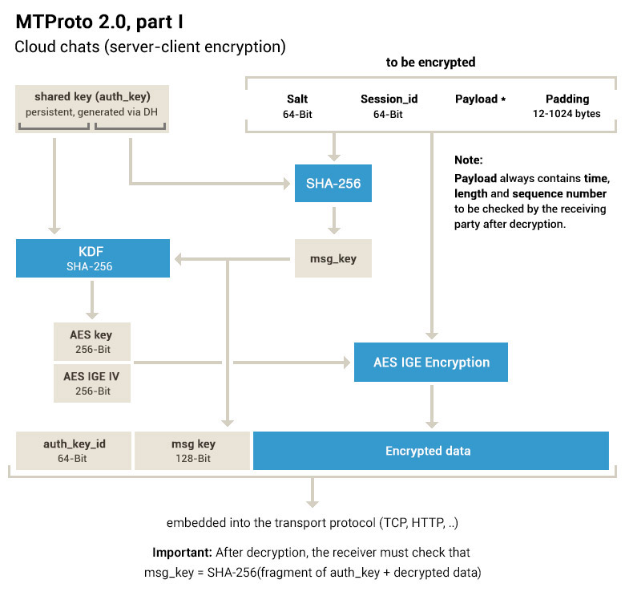

# MTProto 移动协议

> 请随时查看我们的面向技术人员的常见问题解答。客户端开发者需要遵守安全指南。

### 相关文章

移动协议：详细描述

创建授权密钥

创建授权密钥：示例

移动协议：服务消息

移动协议：关于消息的服务消息

二进制数据序列化

TL 语言

MTProto TL-schema

端到端加密，秘密聊天

端到端 TL-schema

客户端软件开发者的安全指南

---

本页面处理用于云聊天（服务器-客户端加密）的MTProto加密的基本层。另请参阅：

- 秘密聊天，端到端加密

- 端到端加密语音通话

### 总体描述

该协议旨在使移动设备上运行的应用程序能够访问服务器API。必须强调的是，Web浏览器不是这样的应用程序。

该协议分为三个几乎独立的组件：

- 高级组件（API查询语言）：定义了API查询和响应如何转换为二进制消息的方法。

- 密码（授权）层：定义了消息在通过传输协议传输之前如何加密的方法。

- 传输组件：定义了客户端和服务器如何通过某些其他现有的网络协议（例如HTTP、HTTPS、WS（普通WebSockets）、WSS（基于HTTPS的WebSockets）、TCP、UDP）传输消息的方法。

  

> 截至版本4.6，主要的Telegram客户端正在使用本文描述的MTProto 2.0。MTProto v1.0（这里进行参考描述）已经被弃用，并正在逐步淘汰。

### 组件简介

#### 高级组件（RPC查询语言/API）

从高级组件的角度来看，客户端和服务器在会话内交换消息。会话连接到客户端设备（更确切地说是应用程序），而不是特定的WebSocket/http/https/tcp连接。此外，每个会话都附加到一个用户密钥ID，通过该ID实际完成授权。

可以打开到服务器的多个连接；消息可以通过任何连接的任何方向发送（对查询的响应不一定通过携带原始查询的相同连接返回，尽管大多数情况下是这样；但是，在任何情况下，消息都不能通过属于不同会话的连接返回）。当使用UDP协议时，响应可能会由与发送查询的IP地址不同的IP地址返回。

有几种类型的消息：

- RPC调用（客户端到服务器）：调用API方法

- RPC响应（服务器到客户端）：RPC调用的结果

- 消息接收确认（或者更确切地说，一组消息的状态通知）

- 消息状态查询

- 多部分消息或容器（包含多个消息的容器；例如，在HTTP连接上一次发送多个RPC调用所需的；另外，容器可以支持gzip）。

从更低级别协议的角度来看，消息是沿着4或16字节边界对齐的二进制数据流。消息中的前几个字段是固定的，并且由加密/授权系统使用。

每个消息，无论是单独的还是在容器内，都包括消息标识符（64位，见下文）、会话内的消息序列号（32位）、长度（消息体的字节长度；32位）和一个体（任何大小，是4字节的倍数）。此外，当发送容器或单个消息时，会在顶部添加一个内部头部（见下文），然后对整个消息进行加密，并在消息的顶部放置一个外部头部（64位密钥标识符和128位消息密钥）。

消息体通常由32位消息类型后跟依赖于类型的参数组成。特别是，每个RPC函数都有一个相应的消息类型。有关更多详细信息，请参见二进制数据序列化，移动协议：服务消息。

所有数字都以小端格式编写。但是，在RSA和DH中使用的非常大的数字（2048位或pq、p、q参数）以大端格式编写，因为这是OpenSSL库的工作方式。

#### 授权和加密

在使用传输协议通过网络传输消息（或多部分消息）之前，它会以某种方式加密，并在消息顶部添加一个外部头部，其中包括：64位密钥标识符（唯一标识服务器和用户的授权密钥）和128位消息密钥。用户密钥与消息密钥一起定义了实际的256位密钥，用于使用AES-256加密消息。请注意，要加密的消息的初始部分包含变量数据（会话、消息ID、序列号、服务器salt），这显然会影响消息密钥（从而影响AES密钥和iv）。消息密钥定义为SHA256消息体的中间128位（包括会话、消息ID等），包括填充字节，前缀是从授权密钥中获取的32个字节。多部分消息被加密为单个消息。

> 有关技术规范，请参阅移动协议：详细描述

客户端应用程序必须做的第一件事是创建授权密钥，通常在首次运行时生成，几乎不会更改。

为了防止攻击者可能截取加密消息并通过某种方式占用授权密钥（例如，通过窃取设备 - 即使在这种情况下，也可以访问设备上缓存的所有信息而不解密任何内容），MTProto在云聊天和秘密聊天中都支持完美前向保密性。

#### 时间同步

如果客户端时间与服务器时间相差很大，服务器可能会开始忽略客户端消息，反之亦然，因为消息标识符无效（与创建时间密切相关）。在这种情况下，服务器将向客户端发送一个包含正确时间和特定128位salt的特殊消息（可以由客户端在特殊的RPC同步请求中显式提供，也可以等于当前会话期间从客户端接收的最新消息的密钥）。如果时间差异很大但尚未导致客户端的消息被忽略，则此消息可以是包含其他消息的容器中的第一个消息。

收到这样的消息或包含它的容器后，客户端首先执行时间同步（实际上只是存储服务器时间与自己时间的差异，以便能够在将来计算“正确”的时间），然后验证消息标识符的正确性。

如果忽略了纠正，客户端将不得不生成一个新的会话以确保消息标识符的单调性。

### MTProto 传输

在使用所选的传输协议发送之前，有效载荷必须包装在由适当的MTProto传输协议定义的次级协议头中。

- 简化版

- 中间

- 填充中间

- 完整版

服务器通过标头识别这些不同的协议（并且也从HTTP中区分出来）。此外，可以使用以下传输功能：

- 快速确认

- 传输错误

- 传输混淆

这些协议的示例实现可以在tdlib和MadelineProto中看到。

### 传输

使加密容器与外部头部（以下简称为有效载荷）从客户端到服务器和返回。 定义了多种传输协议：

- TCP

- WebSocket

- WebSocket over HTTPS

- HTTP

- HTTPS

- UDP

（我们只研究前五种类型。）

### 总结

简而言之，与ISO/OSI堆栈进行比较：

- 层7（应用程序）：高级RPC API

- 层6（表示）：类型语言

- 层5（会话）：MTProto会话

- 层4（传输）：

  - 4.3：MTProto传输协议

  - 4.2：MTProto混淆（可选）

  - 4.1：传输协议

- 层3（网络）：IP

- 层2（数据链路）：MAC/LLC

- 层1（物理）：IEEE 802.3，IEEE 802.11等...
